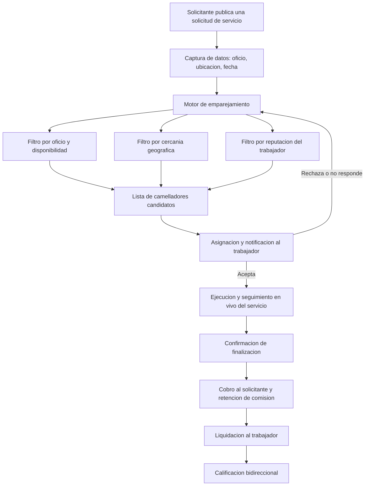

# Arquitectura Empresarial — Caso de Estudio CamelloYa

Este repositorio contiene el desarrollo de una **Arquitectura Empresarial utilizando el framework TOGAF (ADM)** para el caso de estudio **CamelloYa**, una plataforma digital de intermediación laboral bajo demanda para la ciudad de Sincelejo.

El trabajo se enmarca en el tema general de la asignatura: **Transformación Digital del Comercio Local de Sincelejo**.

- **Asignatura:** Arquitectura Empresarial de TI
- **Programa:** Ingeniería de Sistemas — Facultad de Ingeniería
- **Institución:** Corporación Universitaria del Caribe (CECAR)
- **Docente:** Jhon Méndez
- **Integrantes:** Marlon Kerguelen, Nakly Contreras
- **Modelo de negocio:** B2B2C

---

## 1. Contexto

Sincelejo presenta una fuerte dinámica de comercio local sostenida por pequeños negocios, comerciantes independientes y micronegocios. Según el DANE, entre octubre y diciembre de 2025 el **67,9 %** de la población ocupada de la ciudad se encontraba en la informalidad, cifra muy superior al promedio nacional (55,7 %), y la Encuesta de Micronegocios 2024 identificó que el **96,4 %** de los micronegocios locales corresponden a trabajadores por cuenta propia.

A pesar de esa informalidad, el comercio local crece: entre 2023 y 2024 los micronegocios de Sincelejo registraron incrementos cercanos al 47,8 % en ingresos nominales y al 45,9 % en valor agregado, y el Nuevo Mercado de la ciudad —con más de 1.000 locales— abasteció 145.338 toneladas de alimentos durante 2025.

Sin embargo, herramientas como redes sociales, WhatsApp, transferencias y coordinación manual de domicilios operan de forma aislada, lo que dificulta gestionar pedidos, pagos, entregas e información de clientes de manera integrada.

## 2. El caso: CamelloYa S.A.S.

**CamelloYa** es una plataforma digital, tipo Uber pero aplicada al trabajo y no al transporte, que conecta en tiempo real a personas que ofrecen mano de obra u oficios con personas y negocios de Sincelejo que necesitan contratar servicios puntuales.

| Elemento | Descripción |
| --- | --- |
| **Problema** | Los trabajadores informales no tienen un canal confiable para conseguir trabajo remunerado inmediato, y quienes necesitan contratar dependen de referencias informales o publicaciones dispersas en redes sociales |
| **Cliente objetivo** | (1) Trabajadores informales e independientes de Sincelejo; (2) personas y micronegocios que requieren contratar oficios puntuales |
| **Propuesta de valor** | Aplicación móvil con emparejamiento en tiempo real, perfiles verificados, calificación bidireccional, cotización clara, pago digital seguro y seguimiento en vivo |
| **Forma de ingresos** | Comisión por transacción, suscripción premium para trabajadores y publicidad de negocios locales |
| **Factor diferenciador** | Enfoque hiperlocal en oficios cortos, verificación de identidad, calificación bidireccional y trazabilidad completa del servicio |

### Misión

Conectar de manera rápida, segura y confiable a trabajadores informales con personas y negocios de Sincelejo que requieren servicios y oficios puntuales, contribuyendo a la generación de ingresos y a la formalización progresiva del trabajo local.

### Visión

Para el año 2030, ser la plataforma líder de intermediación laboral bajo demanda en la región Caribe colombiana, reconocida como referente en la formalización digital del empleo informal.

---

## 3. Desafíos iniciales

- Canales digitales fragmentados: promoción, pedidos, pagos y coordinación ocurren en herramientas distintas y no integradas.
- Ausencia de mecanismos de verificación de identidad y reputación en los canales informales actuales.
- Dependencia de múltiples proveedores externos (pagos, mapas, identidad, mensajería) sin estándares comunes de integración.
- Exigencias regulatorias sobre tratamiento de datos personales e intermediación laboral.
- Cobertura de conectividad variable entre el centro y las zonas periféricas de la ciudad.

## 4. Objetivos del proyecto de Arquitectura Empresarial

- Alinear la estrategia de negocio de CamelloYa con sus capacidades tecnológicas.
- Estandarizar las integraciones con proveedores externos y el gobierno de los datos.
- Diseñar una arquitectura escalable, liviana y tolerante a baja conectividad.
- Reducir los riesgos operativos y regulatorios asociados a la intermediación laboral.
- Establecer una gobernanza arquitectónica formal y trazable.

## 5. Flujo del proceso de negocio



## 6. Estrategia de negocio

Estrategia de **diferenciación enfocada en un nicho hiperlocal**, apalancada en tecnología móvil y en la confianza generada por la verificación de identidad y las calificaciones bidireccionales.

### Objetivos estratégicos

| Código | Objetivo estratégico |
| --- | --- |
| **OE01** | Alcanzar 5.000 usuarios registrados durante el primer año de operación en Sincelejo |
| **OE02** | Lograr una tasa de finalización exitosa de servicios superior al 90 % |
| **OE03** | Establecer alianzas con al menos tres gremios o asociaciones de comerciantes del Nuevo Mercado durante el primer año |

### Capacidades empresariales

1. Gestión de emparejamiento oferta–demanda (matching)
2. Verificación y gestión de identidad y reputación
3. Gestión de pagos digitales
4. Gestión de alianzas y relaciones locales
5. Analítica de datos e inteligencia de mercado

---

## 7. Equipo de trabajo

Este caso de estudio fue desarrollado de forma conjunta por:

- **Marlon Kerguelen**
- **Nakly Contreras** — Desarrollo Full Stack

La distribución formal de los roles del equipo de Arquitectura Empresarial (Arquitecto Empresarial, de Soluciones, de Datos y de Seguridad) está documentada en el Paso 3 de la Fase Preliminar. Al tratarse de un equipo reducido, los roles se asumen de manera compartida y cada artefacto tiene un integrante responsable de su elaboración y otro de su revisión, mediante revisión cruzada antes de publicarlo en este repositorio.

## 8. Estructura del repositorio

```
.
├── README.md
├── Taller1/                            Construccion del caso de negocio
│   └── Taller_1_CamelloYa.docx
└── Taller2_Preliminar/                 Fase Preliminar del ADM
    ├── 01_alcance_enterprise.docx      Alcance del Enterprise
    ├── 02_gobernanza_frameworks.docx   Frameworks de gobernanza y soporte
    ├── 03_equipo_arquitectura.docx     Equipo de Arquitectura Empresarial
    ├── 04_principios_arquitectura.docx Principios de Arquitectura
    ├── 05_adaptacion_togaf.docx        Adaptacion del framework TOGAF
    └── 06_estrategia_herramientas.docx Estrategia de herramientas y tecnicas
```

## 9. Avance por fases del ADM

| Taller | Fase TOGAF | Estado |
| --- | --- | --- |
| #1 | Construcción del caso de negocio | Entregado |
| #2 | Preliminary | Entregado |
| #3 | A — Architecture Vision | Pendiente |
| — | B — Business Architecture | Pendiente |
| — | C — Information Systems Architecture | Pendiente |
| — | D — Technology Architecture | Pendiente |

---

## 10. Fuentes oficiales de referencia

- DANE — Gran Encuesta Integrada de Hogares (GEIH), diciembre de 2025.
- DANE — Encuesta de Micronegocios (EMICRON), resultados 2024.
- DANE — Sistema de Información de Precios y Abastecimiento del Sector Agropecuario (SIPSA), marzo de 2026.
